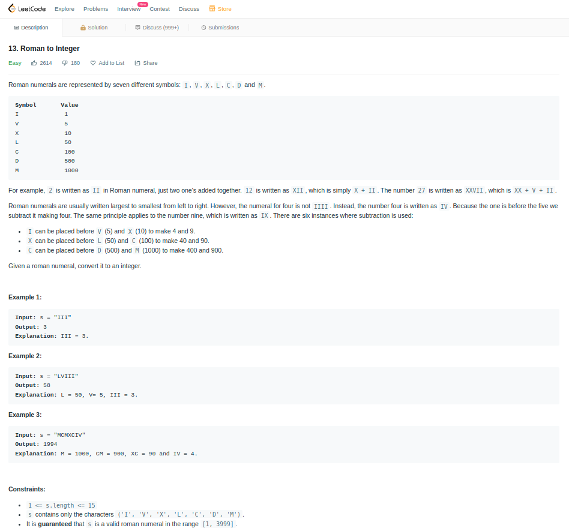

# Leetcode

[roman to integer](https://leetcode.com/problems/roman-to-integer/)

# conan
Cmd: conan install -pr:b=default  --profile default-abi11 -s build_type=Debug ../conanfile.txt
-DCMAKE_TOOLCHAIN_FILE=conan_toolchain.cmake

# TDD demo
## header: 
https://github.com/kobi-ca/leetcode-roman-to-integer/blob/e8b442e248917f35759d8c4ab6c839abfc1fa462/roman-to-integer.hpp
## First
* https://github.com/kobi-ca/leetcode-roman-to-integer/blob/8c013cae59a74110eee78ef152fbe84411720c39/test.cpp
* https://github.com/kobi-ca/leetcode-roman-to-integer/blob/8c013cae59a74110eee78ef152fbe84411720c39/roman-to-integer.cpp
## Second
* https://github.com/kobi-ca/leetcode-roman-to-integer/blob/4e54286c870a30304323f2ca7876677046dbb78c/roman-to-integer.cpp
* https://github.com/kobi-ca/leetcode-roman-to-integer/blob/4e54286c870a30304323f2ca7876677046dbb78c/test.cpp 
## Third
* https://github.com/kobi-ca/leetcode-roman-to-integer/blob/e8b442e248917f35759d8c4ab6c839abfc1fa462/roman-to-integer.cpp
* https://github.com/kobi-ca/leetcode-roman-to-integer/blob/e8b442e248917f35759d8c4ab6c839abfc1fa462/test.cpp 
